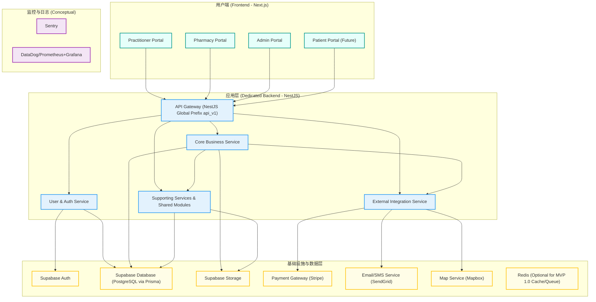

**文档版本：** 1.2
**日期：** [当前日期]
**目标阶段：** MVP 1.0 - 核心功能上线与市场评测
**核心技术栈：** Next.js (Frontend), NestJS + Prisma + TypeScript (Backend), Supabase (PostgreSQL, Auth, Storage)

---

**目录**

1.  [项目概述与 MVP 1.0 目标](#1-项目概述与-mvp-10-目标)
    1.1. [项目愿景](#11-项目愿景)
    1.2. [MVP 1.0 核心功能范围](#12-mvp-10-核心功能范围)
    1.3. [MVP 1.0 预期上线评测目标与衡量标准 (KPIs)](#13-mvp-10-预期上线评测目标与衡量标准-kpis)
2.  [用户角色与权限](#2-用户角色与权限)
3.  [技术架构与选型 (最终决策)](#3-技术架构与选型-最终决策)
    3.1. [整体架构图 (Conceptual)](#31-整体架构图-conceptual)
    3.2. [后端技术栈](#32-后端技术栈)
    3.3. [部署架构 (参考 `MVP 1.0 部署架构设计.md`)](#33-部署架构-参考-mvp-10-部署架构设计md)
    3.4. [核心设计原则](#34-核心设计原则)
4.  [核心后端服务/模块定义 (MVP 1.0)](#4-核心后端服务模块定义-mvp-10)
    4.1. [User & Auth Service (用户与认证服务)](#41-user--auth-service-用户与认证服务)
    4.2. [Core Business Service (核心业务服务)](#42-core-business-service-核心业务服务)
    4.3. [External Integration Service (外部集成服务)](#43-external-integration-service-外部集成服务)
    4.4. [Supporting Services & Shared Modules](#44-supporting-services--shared-modules)
5.  [数据库设计 (Supabase PostgreSQL)](#5-数据库设计-supabase-postgresql)
    5.1. [核心表结构 (参考 `MVP 1.0 核心数据库表结构设计.md`)](#51-核心表结构-参考-mvp-10-核心数据库表结构设计md)
    5.2. [索引策略 (参考 `MVP 1.0 核心数据库表结构设计.md`)](#52-索引策略-参考-mvp-10-核心数据库表结构设计md)
    5.3. [RLS 策略初步](#53-rls-策略初步)
    5.4. [数据迁移 (Prisma Migrate)](#54-数据迁移-prisma-migrate)
    5.5. [敏感数据加密初步考虑](#55-敏感数据加密初步考虑)
6.  [API 设计规范与核心端点 (参考 `MVP 1.0 API设计规范和核心端点.md`)](#6-api-设计规范与核心端点-参考-mvp-10-api设计规范和核心端点md)
    6.1. [API 设计原则](#61-api-设计原则)
    6.2. [核心 API 端点清单 (高级别)](#62-核心-api-端点清单-高级别)
    6.3. [OpenAPI/Swagger 规范](#63-openapiswagger-规范)
7.  [第三方服务集成策略](#7-第三方服务集成策略)
8.  [开发流程与规范](#8-开发流程与规范)
    8.1. [版本控制](#81-版本控制)
    8.2. [代码风格与规范](#82-代码风格与规范)
    8.3. [测试策略](#83-测试策略)
    8.4. [CI/CD 初步规划](#84-cicd-初步规划)
    8.5. [文档规范](#85-文档规范)
9.  [MVP 1.0 后端开发任务拆解与顺序](#9-mvp-10-后端开发任务拆解与顺序)
    9.1. **Phase 0: 技术决策与准备 (已完成)**
    9.2. **Phase 1: 核心基础设施与服务搭建 (4 周)**
        9.2.1. **任务 1 (优先级 P0 - Week 1): Prisma Schema 实现与数据库初始化**
        9.2.2. **任务 2 (优先级 P0 - Week 1-2): NestJS 项目骨架与核心模块搭建**
        9.2.3. **任务 3 (优先级 P0 - Week 1-2): 用户与认证服务 (User & Auth Service) - 核心 API**
        9.2.4. **任务 4 (优先级 P1 - Week 2-3): 药品信息管理服务 (Medicine/PIM Service) - 核心 API**
        9.2.5. **任务 5 (优先级 P0 - Week 3-4): 核心业务服务 (Core Business Service) - 处方与订单/凭证创建流程**
        9.2.6. **任务 6 (优先级 P0 - Week 3-4): 支付与结算服务 (Payment & Settlement Service) - 基础支付意图与诊所账户逻辑**
        9.2.7. **任务 7 (优先级 P1 - Week 4): 文件服务 (File Service) 与药房报价服务 (Pharmacy & Quoting Service) - 基础履约凭证上传与查看**
        9.2.8. **任务 8 (优先级 P1 - Week 4): 通知服务 (Notification Service) - 基础邮件通知**
    9.3. **Phase 2: 核心流程完善与管理功能 (后续规划)**
10. [风险识别与应对](#10-风险识别与应对)
11. [附录](## 11. 附录)
    11.1. [MVP 1.0 核心数据库表结构设计.md]
    11.2. [MVP 1.0 API设计规范和核心端点.md]
    11.3. [MVP 1.0 部署架构设计.md]
    11.4. [用户角色权限矩阵]
    11.5. [业务规则决策表]
    11.6. [前端后端数据交互格式表示例]
    11.7. [UI状态与后端状态映射表示例]
	11.8. [统一订单状态机定义]  
	11.9. [MVP 1.0 核心支付流程 (诊所预付/信用额度模式)]
---

**1. 项目概述与 MVP 1.0 目标**

*   **1.1. 项目愿景:**
    为新西兰中医师提供一个高效、便捷、合规的电子处方和草药调配协作平台，降低其运营成本和复杂度，提升患者服务体验，推动中医药在新西兰的现代化发展。
*   **1.2. MVP 1.0 核心功能范围:**
    *   **核心业务闭环:**
        1.  **医生开方:** 医生使用平台搜索药品、创建电子处方。
        2.  **诊所账户支付:** 系统从医生关联诊所的预付/信用账户中实时扣除订单成本 (B)。
        3.  **凭证生成与交付:** 支付成功 (订单状态变为 PAID) 后，平台生成包含唯一订单号和 QR 码的有效电子凭证，由医生交付给患者。
        4.  **药房扫码与订单验证:** 患者持凭证到合作药房，药房操作员扫描 QR 码或输入订单号，平台后端通过内部 API (P1-P2 逻辑) 验证订单真实性与核心信息。
        5.  **药房履约与凭证提交:** 药房完成配药，上传履约照片等证明材料。订单状态更新为 PENDING_REVIEW。
        6.  **管理员手动审核:** 平台管理员审核药房提交的履约凭证。审核通过则订单状态更新为 FULFILLED，拒绝则为 REJECTED。
        7.  **平台与药房结算:** 审核通过后，系统自动生成与药房的结算记录 (待支付 C)，管理员标记支付后自动通知药房。
    *   **关键支撑功能:**
        *   用户（医师、药房操作员、管理员）注册、登录、个人资料管理。
        *   药品目录基础管理（管理员）与查询（医师、药房）。
        *   医师处方模板管理 (CRUD)。
        *   医师处方历史查看。
        *   患者端药房查找 API（地理位置、药品供应能力初筛）。
        *   医生推荐机制后端逻辑。
        *   基础的管理员后台数据查看接口（用户、药品、药房列表）。
*   **1.3. MVP 1.0 预期上线评测目标与衡量标准 (KPIs):**
    *   **用户增长与活跃度:** 月活跃医师 (MAU) 数量，医师周平均处方量，医师留存率。
    *   **业务与履约效率:** 月总订单数，订单成功履约率，平均订单履约时长（从支付到药房确认完成）。
    *   **药房合作:** 合作药房数量，活跃药房比例，药房平均处理订单量。
    *   **平台财务:** 月度 GTV (基于诊所支付的 B 价总和)，月度毛利 (SUM(B-C))，关键运营成本（如支付网关费、物流费-如果平台承担）。
    *   **用户反馈:** 通过问卷、访谈收集至少 [X] 位医生和 [Y] 家药房的定性反馈。

**2. 用户角色与权限**

*   **核心用户角色:** 医生 (Doctor), 药房操作员 (Pharmacy Operator), 平台管理员 (Admin)。
*   **权限模型:** 遵循产品经理提供的 **用户角色权限矩阵** (见附录 11.4)。后端将通过 NestJS Guards 和自定义装饰器实现 RBAC。

**3. 技术架构与选型 (最终决策)**

*   **3.1. 整体架构图 (Conceptual):**
    *   (参考 `MVP 1.0 部署架构设计.md` 中的图示，并结合以下服务模块进行理解)


*   **3.2. 后端技术栈:**
    *   **语言/框架:** Node.js + **NestJS** (TypeScript)
    *   **数据库:** Supabase PostgreSQL (托管服务)
    *   **ORM:** **Prisma**
    *   **认证:** Supabase Auth (JWTs，由 Dedicated Backend 统一封装)
    *   **文件存储:** Supabase Storage (通过 Backend 生成签名 URL)
    *   **API 类型:** RESTful API (OpenAPI v3.x 规范)
*   **3.3. 部署架构:**
    *   参考 `MVP 1.0 部署架构设计.md`。重点：Frontend (Vercel), Backend (Dockerized NestJS on Render.com), Supabase Cloud (Pro Plan)。
*   **3.4. 核心设计原则:**
    *   API First, Stateless Backend Services, Security by Design, Privacy by Design, Modularity, Testability, DRY (Don't Repeat Yourself), KISS (Keep It Simple, Stupid) for MVP.

**4. 核心后端服务/模块定义 (MVP 1.0)**

*   **4.1. User & Auth Service (用户与认证服务)**
    *   **职责:** 用户注册、登录、JWT签发与校验、密码管理、用户Profile管理、角色管理、医生推荐码逻辑。
    *   **核心攻关问题:**
        *   NestJS 与 Supabase Auth 的安全高效集成 (JWT生命周期管理)。
        *   基于 Prisma 和 NestJS Guards 实现灵活的 RBAC。
*   **4.2. Core Business Service (核心业务服务)**
    *   **职责:** 处方创建与状态管理、订单/凭证生命周期，严格遵循统一的订单状态机 (含QR码数据生成，见附录 11.8）、药房报价提交与管理员手动审核流程、支付流程编排(核心实现“诊所预付/信用账户实时扣款”模式, 见附录 11.9)**、与药房的结算记录生成。
    *   **核心攻关问题:**
        *   `orders` 表状态机的准确实现与事务保证 (使用 Prisma `$transaction`)，确保状态流转符合附录 11.8 定义。
        *   诊所信用/预付账户体系的设计与实时扣款逻辑的可靠性，处理余额不足等异常情况。
        *   P1-P2 订单信息验证 API 的设计与安全实现。
*   **4.3. External Integration Service (外部集成服务)**
    *   **职责:** 统一管理与第三方服务的交互：支付网关 (Stripe, MVP 1.0 阶段主要用于诊所账户的充值功能，或为未来患者直付平台预留接口。核心订单支付通过内部账户系统)、邮件服务 (SendGrid)、地图服务 (Mapbox)。
    *   **核心攻关问题:**
        *   Stripe 支付意图创建、支付成功/失败 Webhook 的安全处理与幂等性。
        *   第三方服务 API 调用的错误处理、重试与降级策略。
*   **4.4. Supporting Services & Shared Modules**
    *   **Medicine/PIM Service:** 药品目录 CRUD (Admin), 药品搜索 API (Practitioner, Pharmacy)。
        *   **核心攻关:** 高效药品搜索实现 (Prisma full-text search 或其他)。
    *   **Pharmacy Service:** 药房信息管理 (Admin, Pharmacy Operator), 患者端药房查找 API。
        *   **核心攻关:** 地理位置查询与基于药品供应能力（非实时）的筛选逻辑。
    *   **File Management Module:** (集成于 Core Business Service 或 External Integration Service) 使用 Supabase Storage 生成签名 URL，处理履约照片等文件。
        *   **核心攻关:** 文件上传/下载流程的安全性与可靠性。
    *   **Notification Module:** (集成于 Core Business Service 或 External Integration Service) 封装邮件通知逻辑。
        *   **核心攻关:** 关键业务节点（如支付成功、订单完成、结算通知）的邮件模板与触发逻辑。
    *   **Admin Support Module:** 为管理后台提供数据查询和操作接口。
    *   **Basic Reporting Module:** 提供计算核心 KPI 的基础 API。
    * - **Clinic Account Service (新增或从 User/Core Business Service 拆分明确):** 专门负责诊所预付款/信用额度的管理、查询、扣款、充值记录等。

**5. 数据库设计 (Supabase PostgreSQL)**

*   **5.1. 核心表结构:**
    *   **严格遵循 `MVP 1.0 核心数据库表结构设计.md` (见附录 11.1)。**
    * - **核心变更:** **orders 表的 status 字段的 CHECK 约束需更新为附录 11.8 中定义的统一订单状态。**
    *   **核心攻关问题:**
        *   `orders` 表与 `clinic_accounts` 表的关联，确保扣款逻辑的准确性。
        *   `fulfillment_proofs` 表与 `orders` 表的关联，支持审核流程。
        *   `pharmacy_inventory` 表在模式二下的简化设计（主要用于药房声明其可供应药品范围和参考批发价，而非实时库存）。
*   **5.2. 索引策略:**
    *   采纳 `MVP 1.0 核心数据库表结构设计.md` 中的建议，并根据 Phase 1 开发中的实际查询进行验证和补充。
*   **5.3. RLS 策略初步:**
    *   对 `user_profiles`, `orders`, `prescriptions` 等表设置基础 RLS，例如用户只能访问自己的 Profile 和订单。Admin 角色可配置更广泛权限。Backend 服务将使用 `service_role` key，但 RLS 作为额外安全层。
*   **5.4. 数据迁移 (Prisma Migrate):**
    *   所有 Schema 变更通过 Prisma Migrate 进行管理。
    *   **核心攻关问题:** 团队成员熟练掌握 Prisma Migrate 的 `dev` 和 `deploy` 命令，确保迁移脚本的正确性和可回滚性（尽管回滚需谨慎）。
*   **5.5. 敏感数据加密初步考虑:**
    *   对于 `user_profiles` 中的某些字段（如 `license_number` 如果被视为高度敏感）和 `orders.patient_info` 中的部分内容，考虑在应用层（Backend）使用对称加密存储。MVP 1.0 阶段，密钥管理可简化为安全的环境变量，未来考虑 KMS。

**6. API 设计规范与核心端点**

*   **6.1. API 设计原则:**
    *   **遵循 `MVP 1.0 API设计规范和核心端点.md` (见附录 11.2)。**
    *   统一响应格式、Bearer Token 认证、URL 版本控制 (`/api/v1/...`)、分页标准、统一错误码和 HTTP 状态码。
*   **6.2. 核心 API 端点清单 (高级别):**
    *   Auth: `/auth/register`, `/auth/login`, `/auth/refresh`, `/auth/me`
    *   Medicines: `GET /medicines`, `GET /medicines/{id}` (Admin: `POST`, `PUT`, `DELETE`)
    *   Prescriptions/Orders: `POST /orders` (创建处方/订单), `GET /orders`, `GET /orders/{id}`, `PATCH /orders/{id}/status`, `POST /orders/{id}/generate-credential`
    *   Templates: `GET /prescription-templates`, `POST /prescription-templates`, `PUT /prescription-templates/{id}` (Doctor only)
    *   Pharmacies: `GET /pharmacies/nearby`, `POST /pharmacies/scan-credential`, `POST /fulfillment-proofs`
    *   Payments: `POST /payments/intent` (for clinic account top-up or future patient direct pay), `POST /payments/webhook`
    *   Files: `POST /files/upload-url`, `POST /files/confirm-upload`
    *   Admin: Endpoints for user management, pharmacy management, quote review, report viewing.
    *   *详细列表和参数见 `MVP 1.0 API设计规范和核心端点.md` 和前端Leader提供的交互表。*
    * - POST /api/v1/orders: 创建订单时，后端需处理诊所账户扣款逻辑，并根据结果设置订单状态为 PAID 或 PAYMENT_FAILED。    
	- PATCH /api/v1/orders/{id}/status: 状态转换需严格遵循订单状态机。    
	- (可能新增) POST /api/v1/clinic-accounts/{accountId}/recharge-intent: 诊所账户充值支付意图创建。
*   **6.3. OpenAPI/Swagger 规范:**
    *   **核心攻关问题:** 在 Phase 1 期间，后端团队需优先完成核心 API 的 OpenAPI 3.0 规范文档，并与前端团队密切评审，确保接口定义清晰、一致，确保 OpenAPI 规范准确反映统一后的订单状态和支付流程。NestJS 内置的 Swagger 模块 (`@nestjs/swagger`) 将用于自动生成和维护此文档。

**7. 第三方服务集成策略**

*   **支付网关:** Stripe (首选)。
*   **邮件服务:** SendGrid (或类似，如 Mailgun)。
*   **地图服务:** Mapbox API (用于药房查找)。
*   **核心攻关问题:** 各服务 SDK 的安全集成、API Key 管理、错误处理和重试机制。

**8. 开发流程与规范**

*   **8.1. 版本控制:** Git (GitHub)，采用 GitFlow 或简化的主干开发+特性分支模型。
*   **8.2. 代码风格与规范:** ESLint, Prettier for TypeScript/JavaScript。遵循 NestJS 最佳实践。
*   **8.3. 测试策略:**
    *   **单元测试 (Jest):** 覆盖 Service 层核心逻辑、工具函数。目标覆盖率：核心业务逻辑 > 70%。
    *   **集成测试 (Jest + Supertest):** 测试 Controller 层 API 接口、Service 与 Prisma/DB 的集成。
    *   **E2E 测试 (Cypress/Playwright):** 由前端或 QA 主导，覆盖核心用户流程。
    *   **核心攻关问题:** 建立可持续的测试文化和实践，确保测试用例与需求同步。
*   **8.4. CI/CD 初步规划:**
    *   **工具:** GitHub Actions。
    *   **流程:** Push to `develop` -> Run Lint, Unit Tests, Integration Tests -> Build Docker Image -> Deploy to Staging. Push/Merge to `main` -> (Manual Trigger) -> Deploy to Production.
    *   *详细配置参考 `MVP 1.0 部署架构设计.md`。*
*   **8.5. 文档规范:**
    *   API 文档: OpenAPI/Swagger (代码即文档)。
    *   架构/设计文档: Markdown 存放于版本库。
    *   代码注释: JSDoc/TSDoc 风格。

**9. MVP 1.0 后端开发任务拆解与顺序**

*   **9.1. Phase 0: 技术决策与准备 (已完成)**
    *   产出: 本 SOP 1.0 文档，技术栈最终决策，详细系统架构图 v1.0，Supabase 环境规划，CI/CD 初步方案。

*   **9.2. Phase 1: 核心基础设施与服务搭建 (预计 4 周)**
    *   **9.2.1. 任务 1 (优先级 P0 - Week 1): Prisma Schema 实现与数据库初始化**
        *   **核心攻关:**
            *   根据 `MVP 1.0 核心数据库表结构设计.md` 和 **附录 11.8 的统一订单状态**，在 `schema.prisma` 中完整定义所有模型、字段、关系和索引。
            *   使用 `prisma migrate dev` 初始化开发数据库，并生成第一个迁移文件。
            *   配置 Supabase 项目 (Dev/Staging) 的数据库连接，确保 Backend 可以连接。
            *   编写基础的种子数据脚本 (Seeding script) 用于填充必要的初始数据（如药品分类、管理员用户）。
        *   **产出:** 可用的数据库 Schema (Prisma Migration files), 初始化数据脚本。

    *   **9.2.2. 任务 2 (优先级 P0 - Week 1-2): NestJS 项目骨架与核心模块搭建**
        *   **核心攻关:**
            *   使用 NestJS CLI 创建项目。
            *   配置核心模块：ConfigModule (环境变量管理，如 `dotenv` 和 NestJS `@nestjs/config`)，LoggerModule (Pino/Winston)，Global Exception Filter (统一错误处理)，ValidationPipe (全局输入验证，使用 `class-validator`)。
            *   集成 PrismaService，确保在 NestJS 服务中可以正确注入和使用 Prisma Client。
            *   搭建基础的 CI 流程 (Linting, Unit Test runner)。
        *   **产出:** 可运行的 NestJS 项目骨架，包含基础配置和核心共享模块。

    *   **9.2.3. 任务 3 (优先级 P0 - Week 1-2): 用户与认证服务 (User & Auth Service) - 核心 API**
        *   **核心攻关:**
            *   实现用户注册 (DTO 验证, Supabase Auth 用户创建, `user_profiles` 表记录)。
            *   实现用户登录 (Supabase Auth 验证, JWT 签发)。
            *   实现 JWT 刷新机制。
            *   实现 `/auth/me` 获取当前用户信息。
            *   实现 JWT Auth Guard 和基础的 Roles Guard 用于 API 保护。
            *   编写对应的单元测试和集成测试。
            * 实现诊所账户 (clinic_accounts) 的基础 CRUD 及与 user_profiles (医师角色) 的关联。
        *   **产出:** 可用的用户认证授权 API (OpenAPI 规范对应部分)+基础诊所账户管理 API。

    *   **9.2.4. 任务 4 (优先级 P1 - Week 2-3): 药品信息管理服务 (Medicine/PIM Service) - 核心 API**
        *   **核心攻关:**
            *   实现药品列表查询 API (支持搜索、分页、排序)。
            *   实现药品详情查询 API。
            *   (Admin) 实现药品 CRUD API 的基础框架（MVP 1.0 管理员端可能仅需查看，但 API 接口预留）。
            *   设计药品搜索的有效 Prisma 查询（考虑性能）。
        *   **产出:** 可用的药品查询 API (OpenAPI 规范对应部分)。

    *   **9.2.5. 任务 5 (优先级 P0 - Week 3-4): 核心业务服务 (Core Business Service) - 处方与订单/凭证创建流程**
        *   **核心攻关:**
            *   - 实现医生创建处方/订单 API，**严格按照附录 11.9 定义的“诊所预付/信用账户实时扣款”流程**，在事务中完成账户检查、扣款、订单创建（状态直接为 PAID 或 PAYMENT_FAILED）。
            *   实现订单/凭证生成逻辑（唯一订单号、QR 码数据生成）。
            *   - 实现订单状态机中从 DRAFT 到 PAID/PAYMENT_FAILED 的流转。
            *   实现医生查询其处方/订单列表和详情的 API。
            *   实现 P1-P2 订单信息验证的内部 API 端点或服务方法。
        *   **产出:** 可用的处方/订单创建和查询 API，核心支付前置流程打通。

    *   **9.2.6. 任务 6 (优先级 P0 - Week 3-4): 支付与结算服务 (Payment & Settlement Service) - 诊所账户管理与扣款逻辑
        *   **核心攻关:**
            *   (如果采用平台代收患者款项模式，此部分会更复杂。当前基于“诊所预付/信用额度”，此服务主要处理平台与诊所、药房的内部账务)
            - **强化诊所账户 (ClinicAccount) 模块：** 提供查询余额/信用额度、记录扣款流水、管理员调整额度等 API。
    		- 设计并实现平台与药房的结算记录 (settlements - 可参考数据库设计中的 transactions 表概念) 生成逻辑（当订单 FULFILLED 时）。
            *   (可选MVP，若Stripe用于诊所充值) 集成 Stripe 创建支付意图 API (用于诊所账户充值)。
            *   处理 Stripe Webhook (用于诊所充值成功确认)。
        *   **产出:** 完善的诊所账户管理与扣款 API，基础的平台-药房结算记录生成逻辑。

    *   **9.2.7. 任务 7 (优先级 P1 - Week 4): 文件服务 (File Service) 与药房报价服务 (Pharmacy & Quoting Service) - 基础履约凭证上传与查看**
        *   **核心攻关:**
            *   实现文件服务 API，用于生成 Supabase Storage 的预签名上传 URL。
            *   实现文件上传确认 API，并将文件信息与 `fulfillment_proofs` 表关联。
            *   实现药房操作员扫描凭证后，调用订单验证 API，获取订单详情的流程。
            *   实现药房提交履约凭证（含文件）的 API，创建 `fulfillment_proofs` 记录，订单状态正确流转至 PENDING_REVIEW。
            *   实现管理员查看待审核履约凭证列表和详情的 API。
        *   **产出:** 药房可提交履约凭证，管理员可查看。

    *   **9.2.8. 任务 8 (优先级 P1 - Week 4): 通知服务 (Notification Service) - 基础邮件通知**
        *   **核心攻关:**
            *   集成邮件服务 (SendGrid)。
            *   实现关键事件的邮件通知模板和发送逻辑（如：药房履约凭证提交成功通知管理员，管理员审核结果通知药房，平台向药房结算支付成功通知，订单支付失败（如余额不足）时对医生的通知。）。
        *   **产出:** 关键业务节点的基础邮件通知功能。

*   **9.3. Phase 2: 核心流程完善与管理功能 (后续规划)**
    *   管理员手动审核履约凭证的完整流程实现。
    *   平台与药房结算的完整流程实现 (标记支付、发送回单)。
    *   患者端药房查找 API 的完善。
    *   医生推荐机制的完整实现。
    *   医师处方模板功能的完整实现。
    *   管理后台其他数据管理和操作 API 的完善。
    *   基础报表服务的 API 实现。
    *   安全加固和性能优化。

**10. 风险识别与应对**

*   **技术栈学习曲线 (NestJS, Prisma):** Phase 0 和 Phase 1 初期安排团队学习和 PoC 时间。
*   **Supabase 性能与限制:** 在 Phase 1 进行针对性测试，如有瓶颈，及时调整方案或优化查询。优先使用付费版以获得更好支持和性能。
*   **第三方服务集成复杂度与不确定性:** 优先集成核心服务 (支付、邮件)，并设计好错误处理和降级。
*   **数据一致性 (尤其在支付和订单状态流转中):** 严格使用数据库事务 (Prisma `$transaction`)，设计幂等接口。
*   **医疗数据合规性:** Phase 1 启动法律咨询，设计阶段预留合规字段和审计日志需求。
*   **API 设计与前后端协作效率:** 严格遵循 OpenAPI 规范，早期高频评审，使用 Mock 工具。

---
## 11. 附录
### 11.1 MVP 1.0核心数据库表结构设计.md
	(**注意：orders.status 的 CHECK 约束需根据 11.8 更新**)
	基于PostgreSQL + Supabase
#### 1. 用户表 (继承Supabase auth.users)
CREATE TABLE user_profiles (
    id UUID PRIMARY KEY REFERENCES auth.users(id) ON DELETE CASCADE,
    role VARCHAR(20) NOT NULL CHECK (role IN ('practitioner', 'patient', 'pharmacy_operator', 'admin')),
    full_name VARCHAR(255) NOT NULL,
    phone VARCHAR(20),
    status VARCHAR(20) DEFAULT 'pending' CHECK (status IN ('pending', 'approved', 'suspended')),
    created_at TIMESTAMPTZ DEFAULT NOW(),
    updated_at TIMESTAMPTZ DEFAULT NOW()
);

#### 2. 诊所表
CREATE TABLE clinics (
    id UUID PRIMARY KEY DEFAULT gen_random_uuid(),
    name VARCHAR(255) NOT NULL,
    address JSONB NOT NULL, -- {street, city, country, postal_code}
    contact JSONB, -- {phone, email}
    license_number VARCHAR(100),
    owner_id UUID REFERENCES user_profiles(id),
    status VARCHAR(20) DEFAULT 'active',
    created_at TIMESTAMPTZ DEFAULT NOW()
);

#### 3. 药品主表
CREATE TABLE medicines (
    id UUID PRIMARY KEY DEFAULT gen_random_uuid(),
    name VARCHAR(255) NOT NULL,
    sku VARCHAR(100) UNIQUE NOT NULL,
    description TEXT,
    category VARCHAR(100),
    unit VARCHAR(50) NOT NULL, -- tablet, ml, mg等
    requires_prescription BOOLEAN DEFAULT true,
    base_price DECIMAL(10,2) NOT NULL,
    metadata JSONB, -- 存储额外的药品信息
    status VARCHAR(20) DEFAULT 'active',
    created_at TIMESTAMPTZ DEFAULT NOW(),
    updated_at TIMESTAMPTZ DEFAULT NOW()
);

#### 4. 药房表
CREATE TABLE pharmacies (
    id UUID PRIMARY KEY DEFAULT gen_random_uuid(),
    name VARCHAR(255) NOT NULL,
    address JSONB NOT NULL,
    coordinates POINT, -- PostGIS地理坐标
    contact JSONB NOT NULL,
    license_info JSONB,
    operator_id UUID REFERENCES user_profiles(id),
    service_hours JSONB, -- 营业时间
    status VARCHAR(20) DEFAULT 'active',
    created_at TIMESTAMPTZ DEFAULT NOW()
);

#### 5. 药房库存表 (简化版本)
CREATE TABLE pharmacy_inventory (
    id UUID PRIMARY KEY DEFAULT gen_random_uuid(),
    pharmacy_id UUID REFERENCES pharmacies(id) ON DELETE CASCADE,  
    medicine_id UUID REFERENCES medicines(id) ON DELETE CASCADE,
    quantity INTEGER NOT NULL DEFAULT 0,
    wholesale_price DECIMAL(10,2),
    retail_price DECIMAL(10,2),
    updated_at TIMESTAMPTZ DEFAULT NOW(),
    UNIQUE(pharmacy_id, medicine_id)
);

#### 6. 处方/订单表 (核心业务实体)
CREATE TABLE orders (
    id UUID PRIMARY KEY DEFAULT gen_random_uuid(),
    platform_order_id VARCHAR(50) UNIQUE NOT NULL, -- 对外显示的订单号
    practitioner_id UUID REFERENCES user_profiles(id),
    patient_id UUID REFERENCES user_profiles(id),
    clinic_id UUID REFERENCES clinics(id),
    
    -- 患者信息快照
    patient_info JSONB NOT NULL, -- {name, phone, address, id_info}
    
    -- 订单状态管理
    status VARCHAR(30) NOT NULL DEFAULT 'draft' 
        CHECK (status IN ('draft', 'pending_payment', 'paid', 'dispensing', 'completed', 'cancelled')),
    
    -- 金额信息
    total_amount DECIMAL(10,2) NOT NULL,
    payment_status VARCHAR(20) DEFAULT 'pending',
    payment_method VARCHAR(50),
    
    -- 履约信息
    assigned_pharmacy_id UUID REFERENCES pharmacies(id),
    dispensed_at TIMESTAMPTZ,
    completed_at TIMESTAMPTZ,
    
    -- 凭证信息
    qr_code_data TEXT, -- QR码内容
    pdf_url TEXT, -- 处方PDF链接
    
    -- 审计信息
    created_at TIMESTAMPTZ DEFAULT NOW(),
    updated_at TIMESTAMPTZ DEFAULT NOW()
);

#### 7. 订单药品明细表
CREATE TABLE order_items (
    id UUID PRIMARY KEY DEFAULT gen_random_uuid(),
    order_id UUID REFERENCES orders(id) ON DELETE CASCADE,
    medicine_id UUID REFERENCES medicines(id),
    
    -- 药品信息快照
    medicine_snapshot JSONB NOT NULL, -- {name, sku, unit}
    
    quantity INTEGER NOT NULL,
    unit_price DECIMAL(10,2) NOT NULL,
    total_price DECIMAL(10,2) NOT NULL,
    
    -- 处方信息
    dosage_instructions TEXT,
    
    created_at TIMESTAMPTZ DEFAULT NOW()
);

#### 8. 支付记录表
CREATE TABLE payments (
    id UUID PRIMARY KEY DEFAULT gen_random_uuid(),
    order_id UUID REFERENCES orders(id) ON DELETE CASCADE,
    
    amount DECIMAL(10,2) NOT NULL,
    currency VARCHAR(3) DEFAULT 'USD',
    payment_method VARCHAR(50) NOT NULL,
    
    -- 第三方支付信息
    provider VARCHAR(50), -- stripe, paypal等
    provider_transaction_id VARCHAR(255),
    provider_response JSONB,
    
    status VARCHAR(20) NOT NULL DEFAULT 'pending'
        CHECK (status IN ('pending', 'processing', 'completed', 'failed', 'refunded')),
    
    processed_at TIMESTAMPTZ,
    created_at TIMESTAMPTZ DEFAULT NOW()
);

#### 9. 履约证明表 (药房提交的配药证明)
CREATE TABLE fulfillment_proofs (
    id UUID PRIMARY KEY DEFAULT gen_random_uuid(),
    order_id UUID REFERENCES orders(id) ON DELETE CASCADE,
    pharmacy_id UUID REFERENCES pharmacies(id),
    
    -- 履约证明文件
    proof_files JSONB NOT NULL, -- [{url, type, filename}]
    notes TEXT,
    
    -- 审核状态
    review_status VARCHAR(20) DEFAULT 'pending'
        CHECK (review_status IN ('pending', 'approved', 'rejected')),
    reviewer_id UUID REFERENCES user_profiles(id),
    review_notes TEXT,
    reviewed_at TIMESTAMPTZ,
    
    created_at TIMESTAMPTZ DEFAULT NOW()
);

#### 10. 系统配置表
CREATE TABLE system_configs (
    key VARCHAR(255) PRIMARY KEY,
    value JSONB NOT NULL,
    description TEXT,
    updated_at TIMESTAMPTZ DEFAULT NOW()
);
#### 11. 诊所账户表
 CREATE TABLE clinic_accounts (
	  id UUID PRIMARY KEY,
	  clinic_id UUID REFERENCES clinics(id),
	  balance DECIMAL(12,2) NOT NULL DEFAULT 0,
	  credit_limit DECIMAL(12,2) NOT NULL DEFAULT 0,
	  used_credit DECIMAL(12,2) NOT NULL DEFAULT 0,
	  status VARCHAR(20) DEFAULT 'active',
	  created_at TIMESTAMPTZ DEFAULT NOW()
);

CREATE TABLE settlements (
	  id UUID PRIMARY KEY,
	  order_id UUID REFERENCES orders(id),
	  pharmacy_id UUID REFERENCES pharmacies(id),
	  amount DECIMAL(10,2) NOT NULL,
	  status VARCHAR(20) DEFAULT 'pending',
	  created_at TIMESTAMPTZ DEFAULT NOW()
);
-- 索引策略
CREATE INDEX idx_orders_status ON orders(status);
CREATE INDEX idx_orders_patient_id ON orders(patient_id);
CREATE INDEX idx_orders_practitioner_id ON orders(practitioner_id);
CREATE INDEX idx_orders_created_at ON orders(created_at DESC);
CREATE INDEX idx_order_items_order_id ON order_items(order_id);
CREATE INDEX idx_payments_order_id ON payments(order_id);
CREATE INDEX idx_pharmacy_inventory_pharmacy_medicine ON pharmacy_inventory(pharmacy_id, medicine_id);

-- 地理空间索引 (用于药房查找)
CREATE INDEX idx_pharmacies_coordinates ON pharmacies USING GIST(coordinates);

-- 触发器：自动更新updated_at
CREATE OR REPLACE FUNCTION update_updated_at_column()
RETURNS TRIGGER AS $$
BEGIN
    NEW.updated_at = NOW();
    RETURN NEW;
END;
$$ language 'plpgsql';

CREATE TRIGGER update_user_profiles_updated_at BEFORE UPDATE ON user_profiles FOR EACH ROW EXECUTE FUNCTION update_updated_at_column();
CREATE TRIGGER update_medicines_updated_at BEFORE UPDATE ON medicines FOR EACH ROW EXECUTE FUNCTION update_updated_at_column();
CREATE TRIGGER update_orders_updated_at BEFORE UPDATE ON orders FOR EACH ROW EXECUTE FUNCTION update_updated_at_column();
### 11.2 MVP 1.0 API设计规范和核心端点.md
%%(**注意：部分端点描述和请求/响应体可能需根据 11.8 和 11.9 微调**)%%
#### API设计原则
##### 1. 统一响应格式

```typescript
// 成功响应
{
  "success": true,
  "data": T, // 实际数据
  "meta"?: {
    "pagination"?: PaginationMeta,
    "timestamp": string
  }
}

// 错误响应  
{
  "success": false,
  "error": {
    "code": string, // 业务错误码
    "message": string, // 用户友好的错误信息
    "details"?: any, // 详细错误信息(开发环境)
    "timestamp": string
  }
}
```

##### 2. 认证机制

- 所有API使用Bearer Token认证
- Token格式：`Authorization: Bearer <jwt_token>`
- 公开接口除外：登录、注册、药品搜索等

##### 3. 分页标准

```typescript
// 请求参数
{
  "page": number, // 页码，从1开始
  "limit": number, // 每页条数，默认20，最大100
  "sort"?: string, // 排序字段，如"created_at:desc"
}

// 响应元数据
{
  "pagination": {
    "page": number,
    "limit": number, 
    "total": number,
    "totalPages": number,
    "hasNext": boolean,
    "hasPrev": boolean
  }
}
```

#### 核心API端点定义

##### 认证模块

```yaml
POST /api/v1/auth/register
  - 用户注册
  - Body: {email, password, role, fullName, ...roleSpecificData}
  - Response: {userId, message}

POST /api/v1/auth/login  
  - 用户登录
  - Body: {email, password}
  - Response: {accessToken, refreshToken, user}

POST /api/v1/auth/refresh
  - Token刷新
  - Body: {refreshToken}
  - Response: {accessToken}

GET /api/v1/auth/me
  - 获取当前用户信息
  - Response: UserProfile
```

##### 药品管理模块

```yaml
GET /api/v1/medicines
  - 药品搜索/列表
  - Query: {search?, category?, page?, limit?, sort?}
  - Response: {medicines: Medicine[], meta}

GET /api/v1/medicines/:id
  - 药品详情
  - Response: Medicine

POST /api/v1/medicines (Admin only)
  - 创建药品
  - Body: MedicineCreateDto
  - Response: Medicine
```

##### 订单管理模块

```yaml
POST /api/v1/orders
  - 创建订单(处方)
  - Body: {patientInfo, clinicId, items: OrderItemDto[]}
  - Response: Order

GET /api/v1/orders
  - 订单列表(基于用户角色返回不同数据)
  - Query: {status?, patientId?, page?, limit?, sort?}
  - Response: {orders: Order[], meta}

GET /api/v1/orders/:id
  - 订单详情
  - Response: OrderDetail

PUT /api/v1/orders/:id
  - 更新订单
  - Body: OrderUpdateDto
  - Response: Order

POST /api/v1/orders/:id/generate-credential
  - 生成订单凭证(QR码和PDF)
  - Response: {qrCodeData, pdfUrl, platformOrderId}
```

##### 药房模块

```yaml
GET /api/v1/pharmacies/nearby
  - 查找附近药房
  - Query: {lat, lng, radius?, limit?}
  - Response: {pharmacies: Pharmacy[]}

POST /api/v1/pharmacies/scan-credential
  - 药房扫描订单凭证
  - Body: {qrCodeData | platformOrderId}  
  - Response: {order: OrderDetail, estimatedPayout}

POST /api/v1/fulfillment-proofs
  - 提交履约证明
  - Body: {orderId, proofFiles: string[], notes?}
  - Response: FulfillmentProof
```

##### 支付模块

```yaml
POST /api/v1/payments/create-intent
  - 创建支付意图
  - Body: {orderId, paymentMethod}
  - Response: {clientSecret, paymentIntentId}

POST /api/v1/payments/confirm
  - 确认支付
  - Body: {paymentIntentId, orderId}
  - Response: Payment

GET /api/v1/payments/status/:orderId
  - 查询支付状态
  - Response: PaymentStatus
```

##### 文件管理模块

```yaml
POST /api/v1/files/upload-url
  - 获取文件上传签名URL
  - Body: {fileName, fileType, bucket}
  - Response: {uploadUrl, downloadUrl, fileId}

POST /api/v1/files/confirm-upload
  - 确认文件上传完成
  - Body: {fileId, metadata?}
  - Response: FileRecord
```

#### 错误码规范

##### HTTP状态码使用

- 200: 成功
- 201: 创建成功
- 400: 请求参数错误
- 401: 未认证
- 403: 权限不足
- 404: 资源不存在
- 409: 资源冲突
- 422: 数据验证失败
- 500: 服务器内部错误

##### 业务错误码

```typescript
enum ErrorCodes {
  // 认证相关 (1xxx)
  INVALID_CREDENTIALS = "1001",
  TOKEN_EXPIRED = "1002", 
  INSUFFICIENT_PERMISSIONS = "1003",
  
  // 订单相关 (2xxx)
  ORDER_NOT_FOUND = "2001",
  ORDER_CANNOT_BE_MODIFIED = "2002",
  INVALID_ORDER_STATUS = "2003",
  
  // 支付相关 (3xxx)
  PAYMENT_FAILED = "3001",
  INSUFFICIENT_FUNDS = "3002",
  PAYMENT_ALREADY_PROCESSED = "3003",
  
  // 药房相关 (4xxx)
  PHARMACY_NOT_AVAILABLE = "4001",
  INVALID_CREDENTIAL = "4002",
  
  // 系统相关 (5xxx)
  EXTERNAL_SERVICE_ERROR = "5001",
  RATE_LIMIT_EXCEEDED = "5002"
},
enum PaymentErrorCodes {
// 建议补充
  INSUFFICIENT_FUNDS = 'PAY_001',
  ACCOUNT_SUSPENDED = 'PAY_002',
  CONCURRENT_PAYMENT = 'PAY_003'
}
```

#### 性能和安全要求

##### 1. 请求限制

- 认证接口: 5次/分钟/IP
- 搜索接口: 100次/分钟/用户
- 创建订单: 10次/分钟/用户
- 文件上传: 20次/小时/用户

##### 2. 数据验证

- 所有输入使用DTO类进行验证
- 敏感操作需要二次验证
- SQL注入防护
- XSS防护

##### 3. 日志记录

- 所有API调用记录访问日志
- 敏感操作记录审计日志
- 错误日志包含足够的调试信息
- 个人信息脱敏处理
### 11.3 MVP 1.0部署架构设计.md

#### 整体部署拓扑

```
                    ┌─────────────────┐
                    │   Cloudflare    │
                    │  (CDN + WAF)    │
                    └─────────┬───────┘
                              │
                    ┌─────────▼───────┐
                    │  Load Balancer  │
                    │   (Render/Fly)  │
                    └─────────┬───────┘
                              │
              ┌───────────────┼───────────────┐
              │               │               │
    ┌─────────▼─────────┐ ┌──▼──┐ ┌─────────▼─────────┐
    │   Backend API     │ │     │ │   Admin Portal    │
    │  (NestJS + Node)  │ │     │ │    (React SPA)    │
    │                   │ │     │ │                   │
    │  - Core Service   │ │     │ │  - User Mgmt      │
    │  - Auth Service   │ │     │ │  - Order Review   │
    │  - File Service   │ │     │ │  - Analytics      │
    └─────────┬─────────┘ │     │ └───────────────────┘
              │           │     │
              │           │     │
    ┌─────────▼─────────┐ │     │ ┌─────────────────────┐
    │    Supabase       │ │     │ │   External APIs     │
    │                   │ │     │ │                     │
    │  - PostgreSQL     │ │     │ │  - Payment Gateway  │
    │  - Auth Service   │ │     │ │  - SMS/Email        │
    │  - File Storage   │ │     │ │  - Maps API         │
    │  - Edge Functions │ │     │ │  - Analytics        │
    └───────────────────┘ │     │ └─────────────────────┘
                          │     │
                          │     │
              ┌───────────▼─────▼─────────────┐
              │      Monitoring Suite        │
              │                              │
              │  - Sentry (Error Tracking)   │
              │  - DataDog (APM)            │
              │  - LogRocket (Session)       │
              │  - Uptime Monitoring        │
              └──────────────────────────────┘
```

#### 环境配置策略

##### 1. 开发环境 (Development)

```yaml
Backend:
  - Local Docker Compose
  - Supabase Local Development
  - Mock External Services
  
Database:
  - Local PostgreSQL via Supabase CLI
  - Test Data Seeding
  
File Storage:
  - Local Minio (S3 Compatible)
```

##### 2. 预发布环境 (Staging)

```yaml
Backend:
  - Render.com Shared Instance
  - Environment Variables via Render
  - Real Supabase Project (Staging)
  
Database:
  - Supabase Staging Project
  - Production-like Data Volume
  
Monitoring:
  - Basic Health Checks
  - Error Reporting
```

##### 3. 生产环境 (Production)

```yaml
Backend:
  - Render.com Professional/Enterprise
  - Auto-scaling enabled
  - Multiple regions (考虑延迟)
  
Database:
  - Supabase Pro Plan
  - Connection Pooling
  - Read Replicas (如需要)
  
Security:
  - WAF via Cloudflare
  - DDoS Protection
  - SSL/TLS Termination
  
Monitoring:
  - Full APM Stack
  - Real-time Alerts
  - Performance Monitoring
```

#### 容器化策略 (Docker)

##### Dockerfile优化

```dockerfile
FROM node:18-alpine AS builder
WORKDIR /app
COPY package*.json ./
RUN npm ci --only=production

FROM node:18-alpine AS runtime
RUN addgroup -g 1001 -S nodejs
RUN adduser -S nestjs -u 1001

WORKDIR /app
COPY --from=builder /app/node_modules ./node_modules
COPY --chown=nestjs:nodejs . .

USER nestjs
EXPOSE 3000
CMD ["node", "dist/main.js"]
```

##### Docker Compose (开发环境)

```yaml
version: '3.8'
services:
  backend:
    build: .
    ports:
      - "3000:3000"
    environment:
      - NODE_ENV=development
      - DATABASE_URL=${DATABASE_URL}
    volumes:
      - .:/app
      - /app/node_modules
    depends_on:
      - postgres
      - redis

  postgres:
    image: postgres:15-alpine
    environment:
      POSTGRES_DB: prescriptchain_dev
      POSTGRES_USER: dev
      POSTGRES_PASSWORD: dev123
    ports:
      - "5432:5432"
    volumes:
      - postgres_data:/var/lib/postgresql/data

  redis:
    image: redis:7-alpine
    ports:
      - "6379:6379"
    volumes:
      - redis_data:/data

volumes:
  postgres_data:
  redis_data:
```

#### CI/CD 流水线

##### GitHub Actions配置

```yaml
name: Deploy to Production

on:
  push:
    branches: [main]

jobs:
  test:
    runs-on: ubuntu-latest
    steps:
      - uses: actions/checkout@v3
      - uses: actions/setup-node@v3
        with:
          node-version: '18'
      - run: npm ci
      - run: npm run test
      - run: npm run test:e2e

  build-and-deploy:
    needs: test
    runs-on: ubuntu-latest
    steps:
      - uses: actions/checkout@v3
      - name: Build Docker Image
        run: docker build -t prescriptchain-api .
      
      - name: Deploy to Render
        uses: render-deploy-action@v1
        with:
          service-id: ${{ secrets.RENDER_SERVICE_ID }}
          api-key: ${{ secrets.RENDER_API_KEY }}
          
      - name: Run Database Migrations
        run: |
          curl -X POST "${{ secrets.DEPLOY_HOOK_URL }}/migrate" \
            -H "Authorization: Bearer ${{ secrets.API_TOKEN }}"
            
      - name: Health Check
        run: |
          sleep 30
          curl -f "${{ secrets.API_URL }}/health" || exit 1
```

#### 监控和告警策略

##### 1. 应用性能监控 (APM)

```typescript
// 关键指标监控
const criticalMetrics = {
  response_time: {
    api_endpoints: "< 500ms (P95)",
    database_queries: "< 100ms (P95)",
    external_apis: "< 2s (P95)"
  },
  
  error_rates: {
    total_errors: "< 1%",
    critical_errors: "0%",
    user_facing_errors: "< 0.5%"
  },
  
  throughput: {
    requests_per_second: "Monitor baseline",
    concurrent_users: "Track peak usage",
    database_connections: "< 80% of limit"
  }
}
```

##### 2. 业务指标监控

```typescript
const businessMetrics = {
  order_funnel: {
    order_creation_rate: "订单创建成功率",
    payment_success_rate: "支付成功率", 
    fulfillment_rate: "履约完成率"
  },
  
  user_experience: {
    registration_success: "注册成功率",
    login_success: "登录成功率",
    search_response_time: "搜索响应时间"
  }
}
```

##### 3. 告警规则

```yaml
Critical Alerts (立即响应):
  - API响应时间 > 2s 持续5分钟
  - 错误率 > 5% 持续2分钟  
  - 数据库连接数 > 90%
  - 支付处理失败率 > 10%

Warning Alerts (工作时间响应):
  - API响应时间 > 1s 持续10分钟
  - 错误率 > 2% 持续5分钟
  - 磁盘使用率 > 80%
  - 内存使用率 > 85%
```

#### 安全配置

##### 1. 网络安全

- WAF规则配置 (SQL注入、XSS防护)
- DDoS保护和流量限制
- IP白名单管理 (管理后台)
- SSL/TLS配置和证书管理

##### 2. 应用安全

- 环境变量加密存储
- API密钥轮换策略
- 数据库连接加密
- 日志敏感信息脱敏

##### 3. 合规要求

- 医疗数据传输加密
- 审计日志完整性
- 备份数据安全存储
- 数据保留策略执行
### 11.4 用户角色权限矩阵
	**目的：** 清晰定义不同用户角色在平台核心功能模块中的操作权限，指导后端 RBAC (Role-Based Access Control) 机制的设计。

	**说明：**
*   **C** = Create (创建)
*   **R** = Read (读取/查看)
*   **U** = Update (更新/修改)
*   **D** = Delete (删除)
*   **-** = 无权限
*   **`*`** = 表示权限受限，例如只能操作与自身相关的数据。

| 功能模块 (Service/Module)    | 医生 (Doctor) | 药房操作员 (Pharmacy Operator) | 管理员 (Admin) | 患者 (Patient) - *未来* |
| :----------------------- | :---------: | :-----------------------: | :---------: | :-----------------: |
| **用户与认证 (User & Auth)**  |             |                           |             |                     |
| 个人 Profile               |     RU*     |            RU*            |      R      |         RU*         |
| 密码管理                     |     U*      |            U*             |      -      |         U*          |
| 推荐码管理                    |     R*      |             -             |    CRUD     |          -          |
| **核心业务 (Core Business)** |             |                           |             |                     |
| 处方管理 (Prescriptions)     |    CRUD*    |             R             |      R      |         R*          |
| 处方模板 (Templates)         |    CRUD*    |             -             |      R      |          -          |
| 订单/凭证管理 (Orders)         |     R*      |            RU*            |    CRUD     |         R*          |
| 报价单管理 (Quotes)           |      -      |           CRU*            |     RUD     |          -          |
| 履约凭证上传 (Proof Upload)    |      -      |            C*             |      R      |          -          |
| **药品信息 (Medicine/PIM)**  |             |                           |             |                     |
| 药品目录查询                   |      R      |             R             |      R      |          R          |
| 药品目录管理                   |      -      |             -             |    CRUD     |          -          |
| **药房管理 (Pharmacy)**      |             |                           |             |                     |
| 药房列表/位置查询                |      R      |             R             |      R      |          R          |
| 药房信息管理                   |      -      |            RU*            |    CRUD     |          -          |
| 药房供应能力配置                 |      -      |            RU*            |    CRUD     |          -          |
| **支付与结算 (Payment)**      |             |                           |             |                     |
| 诊所信用/预付账户                |     R*      |             -             |    CRUD     |          -          |
| 平台与药房结算记录                |      -      |            R*             |    CRUD     |          -          |
| **报表与分析 (Reporting)**    |             |                           |             |                     |
| 个人业务报表                   |     R*      |            R*             |      R      |         R*          |
| 平台整体报表                   |      -      |             -             |      R      |          -          |

### 11.5 业务规则决策表
	**目的：** 将 SOP 0.5 中关键的、复杂的业务逻辑以规则/条件/动作的形式进行梳理，为后端服务中的状态机、校验逻辑和自动化流程设计提供明确依据。

| 规则场景 (Rule Scenario) | 条件 1 (Condition 1) | 条件 2 (Condition 2) | 条件 3 (Condition 3) | 动作 (Action) | 备注 (Notes) |
| :----------------------- | :--------------------- | :--------------------- | :--------------------- | :--------------------------------------------------------------------------------------------------------------------------------------------------------------------------------------------------------------------------------------------------------------------------------------------------------------------------------------------------------------------------------------------------------------------------------------------------------------------------------------------------------------------------------------------------------------------------------------------------------------------------------------------------------------------------------------------------------------------------------------------------------------------------------------------------------------------------------------------------------------------------------------------------------------------------------------------------------------------------------------------------------------------------------------------------------------------------------------------------------------------------------------------------------------------------------------------------------------------------------------------------------------------------------------------------------------------------------------------------------------------------------------------------------------------------------------------------------------------------------------------------------------------------------------------------------------------------------------------------------------------------------------------------------------------------------------------------------------------------------------------------------------------------------------------------------------------------------------------------------------------------------------------------------------------------------------------------------------------------------------------------------------------------------------------------------------------------------------------------------------------------------------------------------------------------------------------------------------------------------------------------------------------------------------------------------------------------------------------------------------------------------------------------------------------------------------------------------------------------------------------------------------------------------------------------------------------------------------------------------------------------------------------------------------------------------------------------------------------------------------------------------------------------------------------------------------------------------------------------------------------------------------------------------------------------------------------------------------------------------------------------------------------------------------------------------------------------------------------------------------------------------------------------------------------------------------------------------------------------------------------------------------------------------------------------------------------------------------------------------------------------------------------------------------------------------------------------------------------------------------------------------------------------------------------------------------------------------------------------------------------------------------------------------------------------------------------------------------------------------------------------------------------------------------------------------------------------------------------------------------------------------------------------------------------------------------------------------------------------------------------------------------------------------------------------------------------------------------------------------------------------------------------------------------------------------------------------------------------------------------------------------------------------------------------------------------------------------------------------------------------------------------------------------------------------------------------------------------------------------------------------------------------------------------------------------------------------------------------------------------------------------------------------------------------------------------------------------------------------------------------------------------------------------------------------------------------------------------------------------------------------------------------------------------------------------------------------------------------------------------------------------------------------------------------------------------------------------------------------------------------------------------------------------------------------------------------------------------------------------------------------------------------------------------------------------------------------------------------------------------------------------------------------------------------------------------------------------------------------------------------------------------------------------------------------------------------------------------------------------------------------------------------------------------------------------------------------------------------------------------------------------------------------------------------------------------------------------------------------------------------------------------------------------------------------------------------------------------------------------------------------------------------------------------------------------------------------------------------------------------------------------------------------------------------------------------------------------------------------------------------------------------------------------------------------------------------------------------------------------------------------------------------------------------------------------------------------------------------------------------------------------------------------------------------------------------------------------------------------------------------------------------------------------------------------------------------------------------------------------------------------------------------------------------------------------------------------------------------------------------------------------------------------------------------------------------------------------------------------------------------------------------------------------------------------------------------------------------------------------------------------------------------------------------------------------------------------------------------------------------------------------------------------------------------------------------------------------------------------------------------------------------------------------------------------------------------------------------------------------------------------------------------------------------------------------------------------------------------------------------------------------------------------------------------------------------------------------------------------------------------------------------------------------------------------------------------------------------------------------------------------------------------------------------------------------------------------------------------------------------------------------------------------------------------------------------------------------------------------------------------------------------------------------------------------------------------------------------------------------------------------------------------------------------------------------------------------------------------------------------------------------------------------------------------------------------------------------------------------------------------------------------------------------------------------------------------------------------------------------------------------------------------------------------------------------------------------------------------------------------------------------------------------------------------------------------------------------------------------------------------------------------------------------------------------------------------------------------------------------------------------------------------------------------------------------------------------------------------------------------------------------------------------------------------------------------------------------------------------------------------------------------------------------------------------------------------------------------------------------------------------------------------------------------------------------------------------------------------------------------------------------------------------------------------------------------------------------------------------------------------------------------------------------------------------------------------------------------------------------------------------------------------------------------------------------------------------------------------------------------------------------------------------------------------------------------------------------------------------------------------------------------------------------------------------------------------------------------------------------------------------------------------------------------------------------------------------------------------------------------------------------------------------------------------------------------------------------------------------------------------------------------------------------------------------------------------------------------------------------------------------------------------------------------------------------------------------------------------------------------------------------------------------------------------------------------------------------------------------------------------------------------------------------------------------------------------------------------------------------------------------------------------------------------------------------------------------------------------------------------------------------------------------------------------------------------------------------------------------------------------------------------------------------------------------------------------------------------------------------------------------------------------------------------------------------------------------------------------------------------------------------------------------------------------------------------------------------------------------------------------------------------------------------------------------------------------------------------------------------------------------------------------------------------------------------------------------------------------------------------------------------------------------------------------------------------------------------------------------------------------------------------------------------------------------------------------------------------------------------------------------------------------------------------------------------------------------------------------------------------------------------------------------------------------------------------------------------------------------------------------------------------------------------------------------------------------------------------------------------------------------------------------------------------------------------------------------------------------------------------------------------------------------------------------------------------------------------------------------------------------------------------------------------------------------------------------------------------------------------------------------------------------------------------------------------------------------------------------------------------------------------------------------------------------------------------------------------------------------------------------------------------------------------------------------------------------------------------------------------------------------------------------------------------------------------------------------------------------------------------------------------------------------------------------------------------------------------------------------------------------------------------------------------------------------------------------------------------------------------------------------------------------------------------------------------------------------------------------------------------------------------------------------------------------------------------------------------------------------------------------------------------------------------------------------------------------------------- | :--------------------------------------------------------------------------------------------------------------------------------------------------------------------------------------------------------------------------------------------------------------------------------------------------------------------------------------------------------------------------------------------------------------------------------------------------------------------------------------------------------------------------------------------------------------------------------------------------------------------------------------------------------------------------------------------------------------------------------------------------------------------------------------------------------------------------------------------------------------------------------------------------------------------------------------------------------------------------------------------------------------------------------------------------------------------------------------------------------------------------------------------------------------------------------------------------------------------------------------------------------------------------------------------------------------------------------------------------------------------------------------------------------------------------------------------------------------------------------------------------------------------------------------------------------------------------------------------------------------------------------------------------------------------------------------------------------------------------------------------------------------------------------------------------------------------------------------------------------------------------------------------------------------------------------------------------------------------------------------------------------------------------------------------------------------------------------------------------------------------------------------------------------------------------------------------------------------------------------------------------------------------------------------------------------------------------------------------------------------------------------------------------------------------------------------------------------------------------------------------------------------------------------------------------------------------------------------------------------------------------------------------------------------------------------------------------------------------------------------------------------------------------------------------------------------------------------------------------------------------------------------------------------------------------------------------------------------------------------------------------------------------------------------------------------------------------------------------------------------------------------------------------------------------------------------------------------------------------------------------------------------------------------------------------------------------------------------------------------------------------------------------------------------------------------------------------------------------------------------------------------------------------------------------------------------------------------------------------------------------------------------------------------------------------------------------------------------------------------------------------------------------------------------------------------------------------------------------------------------------------------------------------------------------------------------------------------------------------------------------------------------------------------------------------------------------------------------------------------------------------------------------------------------------------------------------------------------------------------------------------------------------------------------------------------------------------------------------------------------------------------------------------------------------------------------------------------------------------------------------------------------------------------------------------------------------------------------------------------------------------------------------------------------------------------------------------------------------------------------------------------------------------------------------------------------------------------------------------------------------------------------------------------------------------------------------------------------------------------------------------------------------------------------------------------------------------------------------------------------------------------------------------------------------------------------------------------------------------------------------------------------------------------------------------------------------------------------------------------------------------------------------------------------------------------------------------------------------------------------------------------------------------------------------------------------------------------------------------------------------------------------------------------------------------------------------------------------------------------------------------------------------------------------------------------------------------------------------------------------------------------------------------------------------------------------------------------------------------------------------------------------------------------------------------------------------------------------------------------------------------------------------------------------------------------------------------------------------------------------------------------------------------------------------------------------------------------------------------------------------------------------------------------------------------------------------------------------------------------------------------------------------------------------------------------------------------------------------------------------------------------------------------------------------------------------------------------------------------------------------------------------------------------------------------------------------------------------------------------------------------------------------------------------------------------------------------------------------------------------------------------------------------------------------------------------------------------------------------------------------------------------------------------------------------------------------------------------------------------------------------------------------------------------------------------------------------------------------------------------------------------------------------------------------------------------------------------------------------------------------------------------------------------------------------------------------------------- |
| **医生创建订单 (Create Order)** | 诊所信用/预付账户状态为“Active” | 账户余额/额度 ≥ 订单成本价 (B) | - | 1. 扣除账户余额/额度 B 元。<br>2. 创建订单，状态为 `Pending Dispensing`。<br>3. 生成有效凭证 (QR码)。 | 核心支付风控。 |
| **医生创建订单 (Create Order)** | 诊所信用/预付账户状态为“Active” | 账户余额/额度 < 订单成本价 (B) | - | 1. 阻止订单创建。<br>2. 返回错误信息：“信用额度不足，请充值。”。 | 确保不产生坏账。 |
| **药房履约 (Fulfill Order)** | 药房提交的订单凭证有效 | 平台通过 P1-P2 API 验证订单信息成功 | 药房已上传履约照片 | 1. 创建报价单 (Quote)，状态为 `Pending Review`。<br>2. 订单状态更新为 `Dispensing`。 | 确保订单真实性。 |
| **药房履约 (Fulfill Order)** | 药房提交的订单凭证有效 | 平台通过 P1-P2 API 验证订单信息失败 | - | 1. 阻止报价单创建。<br>2. 返回错误信息：“订单信息验证失败，请联系平台。”。 | 防欺诈关键环节。 |
| **管理员审核 (Admin Review)** | 报价单状态为 `Pending Review` | 管理员审核通过 | - | 1. 更新报价单状态为 `Approved`。<br>2. **自动触发**创建平台与药房的结算记录 (Settlement Record)，状态为 `Pending Payment`。<br>3. 订单状态更新为 `Fulfilled`。 | 自动化结算流程。 |
| **管理员审核 (Admin Review)** | 报价单状态为 `Pending Review` | 管理员审核拒绝 | - | 1. 更新报价单状态为 `Rejected`。<br>2. 订单状态回滚或标记为 `Review Failed`。<br>3. 通知相关方（管理员、药房）。 | 异常处理流程。 |
| **平台结算 (Platform Settlement)** | 结算记录状态为 `Pending Payment` | 管理员在后台标记“已支付” | - | 1. 更新结算记录状态为 `Paid`。<br>2. **自动触发**向药房发送支付成功回单邮件。 | 自动化通知。 |

### 11.6 前后端数据交互格式表示例

| 页面/组件 | 功能模块 | API端点 | HTTP方法 | 请求格式 | 响应格式 | 错误处理 | 加载状态 | 优先级 |
|----------|----------|---------|----------|----------|----------|----------|----------|--------|
| 登录页面 | 用户认证 | `/api/v1/auth/login` | POST | `{email: string, password: string}` | `{user: UserProfile, tokens: {accessToken, refreshToken, expiresIn}}` | 表单验证+全局错误提示 | 登录按钮Loading | P0 |
| 注册页面 | 用户认证 | `/api/v1/auth/register` | POST | `{email, password, role, profile: {name, clinic?, pharmacy?}}` | `{user: UserProfile, tokens: TokenPair}` | 字段级验证+全局提示 | 注册按钮Loading | P0 |
| Token刷新 | 用户认证 | `/api/v1/auth/refresh` | POST | `{refreshToken: string}` | `{accessToken: string, expiresIn: number}` | 静默重试+登出 | 静默处理 | P0 |
| 用户信息 | 用户管理 | `/api/v1/users/profile` | GET | `headers: {Authorization}` | `{id, email, role, profile, createdAt}` | 权限错误处理 | Skeleton加载 | P0 |
| 药品搜索 | 药品管理 | `/api/v1/medicines` | GET | `{q?: string, page: number, limit: number, sort?: string}` | `{data: Medicine[], meta: PaginationMeta}` | 空状态+搜索错误 | 搜索Loading+列表Skeleton | P0 |
| 药品详情 | 药品管理 | `/api/v1/medicines/:id` | GET | `path: {id: string}` | `{id, chineseName, englishName, pinyinName, price, description}` | 404处理+重试 | 详情页Skeleton | P1 |
| 处方创建 | 核心业务 | `/api/v1/prescriptions` | POST | `{items: PrescriptionItem[], patientInfo: PatientInfo, notes?: string}` | `{orderId, orderNumber, qrCode, paymentAmount, status}` | 表单验证+业务错误 | 提交Loading+禁用 | P0 |
| 处方列表 | 核心业务 | `/api/v1/prescriptions` | GET | `{page, limit, status?, dateFrom?, dateTo?}` | `{data: Prescription[], meta: PaginationMeta}` | 空状态+筛选错误 | 列表Loading+Skeleton | P0 |
| 订单详情 | 核心业务 | `/api/v1/orders/:id` | GET | `path: {id: string}` | `{order: OrderDetail, items: OrderItem[], patient: PatientInfo, clinic: ClinicInfo}` | 权限+404处理 | 详情Skeleton | P0 |
| 药房搜索 | 药房服务 | `/api/v1/pharmacies/search` | GET | `{lat: number, lng: number, radius: number, medicines?: string[]}` | `{pharmacies: PharmacyLocation[], searchCenter, searchRadius}` | 地理位置错误+空结果 | 地图Loading+列表Skeleton | P1 |
| 履约照片上传 | 文件服务 | `/api/v1/files/presigned-url` | POST | `{fileName: string, fileType: string, fileSize: number, purpose: string}` | `{uploadUrl: string, fields: object, fileId: string, expiresIn: number}` | 文件格式+大小验证 | 上传进度条 | P1 |
| 上传确认 | 文件服务 | `/api/v1/files/confirm` | POST | `{fileId: string, actualSize: number, checksum?: string}` | `{fileUrl: string, status: 'confirmed'}` | 上传失败重试 | 确认Loading | P1 |
| 订单状态更新 | 核心业务 | `/api/v1/orders/:id/status` | PATCH | `{status: OrderStatus, fulfillmentProof?: {fileIds: string[], notes: string}}` | `{order: OrderDetail, updatedAt: string}` | 状态转换验证 | 状态更新Loading | P0 |
| 通知轮询 | 通知服务 | `/api/v1/notifications/poll` | GET | `{lastPolledAt?: string, limit?: number}` | `{notifications: Notification[], unreadCount: number, lastPolledAt: string}` | 网络错误静默处理 | 后台轮询 | P1 |
| 管理员用户列表 | 管理后台 | `/api/v1/admin/users` | GET | `{page, limit, role?, status?, search?}` | `{data: AdminUserList[], meta: PaginationMeta}` | 权限检查+筛选错误 | 表格Loading | P2 |
| 履约审核 | 管理后台 | `/api/v1/admin/fulfillments/:id/review` | POST | `{decision: 'approve'|'reject', comments?: string}` | `{fulfillment: FulfillmentDetail, reviewedAt: string}` | 审核冲突处理 | 审核按钮Loading | P1 |

### 11.7 UI状态与后端状态映射表示例

| 后端状态/数据 | 前端UI状态 | 显示样式 | 用户操作 | 状态转换逻辑 | 权限控制 |
|--------------|------------|----------|----------|--------------|----------|
| **订单状态映射** | | | | | |
| `draft` | 草稿 | 灰色标签 | 编辑、删除、提交 | 可转换为pending_payment | 创建者可操作 |
| `pending_payment` | 待支付 | 橙色标签+倒计时 | 支付、取消 | 支付成功→paid，超时→cancelled | 创建者+管理员 |
| `paid` | 已支付 | 绿色标签 | 查看详情、联系药房 | 药房操作后→dispensing | 只读，除药房操作 |
| `dispensing` | 配药中 | 蓝色标签+进度指示 | 药房:提交履约证明 | 提交证明→under_review | 药房可操作 |
| `under_review` | 审核中 | 黄色标签 | 管理员:审核 | 审核通过→fulfilled，拒绝→dispensing | 管理员可审核 |
| `fulfilled` | 已完成 | 深绿色标签+完成图标 | 评价、查看详情 | 终态，可申请售后 | 只读 |
| `cancelled` | 已取消 | 红色标签 | 查看取消原因 | 终态 | 只读 |
| **用户认证状态** | | | | | |
| `authenticated` | 已登录 | 显示用户头像+角色 | 访问授权页面 | token过期→unauthenticated | 基于角色显示功能 |
| `unauthenticated` | 未登录 | 显示登录按钮 | 只能访问公开页面 | 登录成功→authenticated | 公开功能only |
| `token_expired` | 令牌过期 | 显示重新登录提示 | 自动刷新或重新登录 | 刷新成功→authenticated | 受限访问 |
| `loading` | 认证检查中 | 显示认证Loading | 禁用所有操作 | 检查完成→对应状态 | 等待状态 |
| **文件上传状态** | | | | | |
| `selecting` | 选择文件 | 上传区域高亮 | 选择/拖拽文件 | 文件选中→validating | 上传权限检查 |
| `validating` | 文件验证中 | 验证进度条 | 等待验证结果 | 验证通过→uploading | 格式大小检查 |
| `uploading` | 上传中 | 上传进度条+百分比 | 取消上传 | 上传完成→confirming | 显示上传速度 |
| `confirming` | 确认中 | 确认状态指示器 | 等待确认 | 确认完成→completed | 等待后端确认 |
| `completed` | 上传完成 | 绿色成功图标 | 预览、删除 | 可重新上传 | 文件管理权限 |
| `failed` | 上传失败 | 红色错误图标+错误信息 | 重试上传 | 重试→uploading | 显示错误详情 |
| **药房营业状态** | | | | | |
| `open` | 营业中 | 绿色圆点+"营业中" | 可下单 | 时间到→closed | 显示营业时间 |
| `closed` | 休息中 | 灰色圆点+"休息中" | 禁止下单 | 营业时间→open | 显示开店时间 |
| `busy` | 繁忙 | 黄色圆点+"繁忙" | 可下单但有延迟提示 | 订单减少→open | 显示预计等待时间 |
| `unavailable` | 暂停服务 | 红色圆点+"暂停服务" | 禁止下单 | 管理员恢复→open | 显示暂停原因 |
| **支付状态** | | | | | |
| `pending` | 支付处理中 | 支付Loading动画 | 等待支付结果 | 成功→completed，失败→failed | 禁用重复支付 |
| `completed` | 支付成功 | 绿色成功图标 | 查看支付详情 | 终态 | 显示支付凭证 |
| `failed` | 支付失败 | 红色失败图标+错误信息 | 重新支付、选择其他方式 | 重试→pending | 显示失败原因 |
| `refunded` | 已退款 | 蓝色退款图标 | 查看退款详情 | 终态 | 显示退款信息 |

### 11.8. 统一订单状态机定义 (新增)  
```  
('DRAFT', 'PENDING_PAYMENT', 'PAYMENT_FAILED', 'PAID', 'PENDING_REVIEW', 'REJECTED', 'FULFILLED', 'CANCELLED', 'EXPIRED')


	- DRAFT: 处方草稿，医生创建但未提交。
    - PENDING_PAYMENT: (保留) 订单已提交，等待支付处理（在实时扣款模式下，此状态短暂或用于异步场景）。
    - PAYMENT_FAILED: 支付失败（例如，诊所账户余额不足）。
    - PAID: 已支付成功（诊所账户已扣款），凭证已生成，等待药房履约。
    - PENDING_REVIEW: 药房已提交履约凭证，等待管理员审核。
    - REJECTED: 管理员审核拒绝履约凭证，等待药房重新提交或进一步处理。
    - FULFILLED: 管理员审核通过，订单履约完成，触发与药房的结算。
    - CANCELLED: 订单因各种原因被取消。
    - EXPIRED: 凭证超时未被履约。
```
        *订单状态机图表需由架构师团队基于此定义更新。*

### 11.9. MVP 1.0 核心支付流程 (诊所预付/信用额度模式) (新增)
    1.  **前提:** 诊所已在平台开设账户 (`clinic_accounts`)，并拥有预付款余额或信用额度。
    2.  **医生提交处方/订单:**
        *   前端将处方信息（药品、数量、患者信息等）提交给后端 `POST /api/v1/orders` 接口。
        *   请求中包含关联的 `clinic_id`。
    3.  **后端处理 (Core Business Service & Payment Service - 事务性操作):**
        *   a. **账户检查:** 根据 `clinic_id` 查询 `clinic_accounts` 表，获取诊所账户状态、余额和信用额度。
        *   b. **成本计算:** 计算该订单的成本价 (B)。
        *   c. **额度/余额校验:**
            *   如果 (余额 + 信用额度) < 订单成本价 (B)，则：
                *   返回错误响应给前端（如 HTTP 402 Payment Required 或自定义业务错误码）。
                *   订单状态可置为 `PAYMENT_FAILED` 或不创建订单。
                *   记录失败原因。
            *   如果 (余额 + 信用额度) ≥ 订单成本价 (B)，则：
                *   **扣款：** 优先扣除余额，不足部分再扣除信用额度。更新 `clinic_accounts` 表的 `balance` 和 `used_credit`。
                *   **创建订单：** 在 `orders` 表中创建新订单，状态直接设置为 `PAID`。记录 `total_amount` (B价)，`payment_status` 为 `completed` (指诊所向平台的支付已完成)。
                *   **生成凭证：** 生成唯一的 `platform_order_id` 和 `qr_code_data`。
                *   返回成功响应给前端，包含订单信息和凭证数据。
    4.  **后续流程:** 患者凭有效凭证（订单状态为 `PAID`）去药房履约。
```