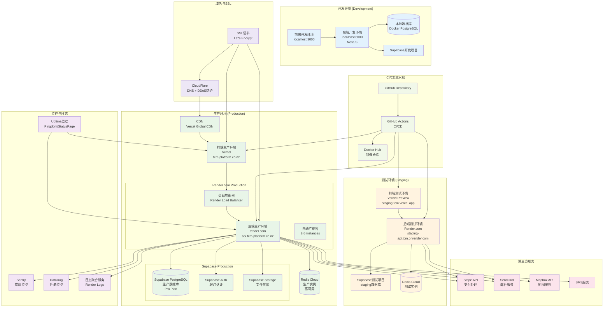
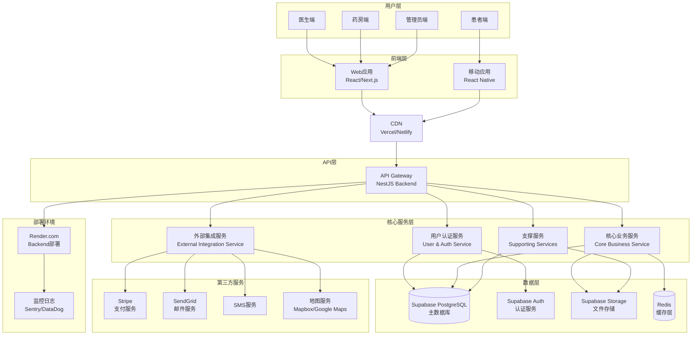
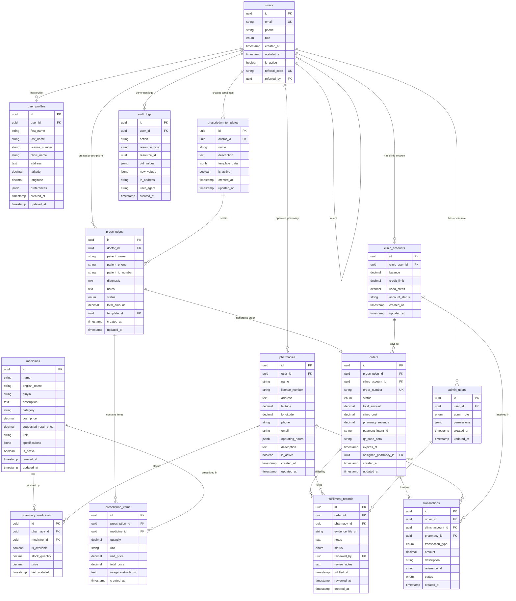
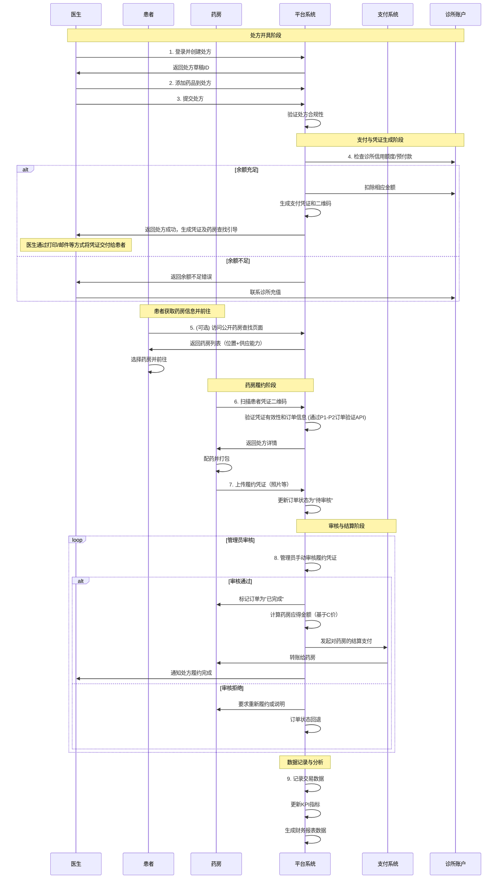
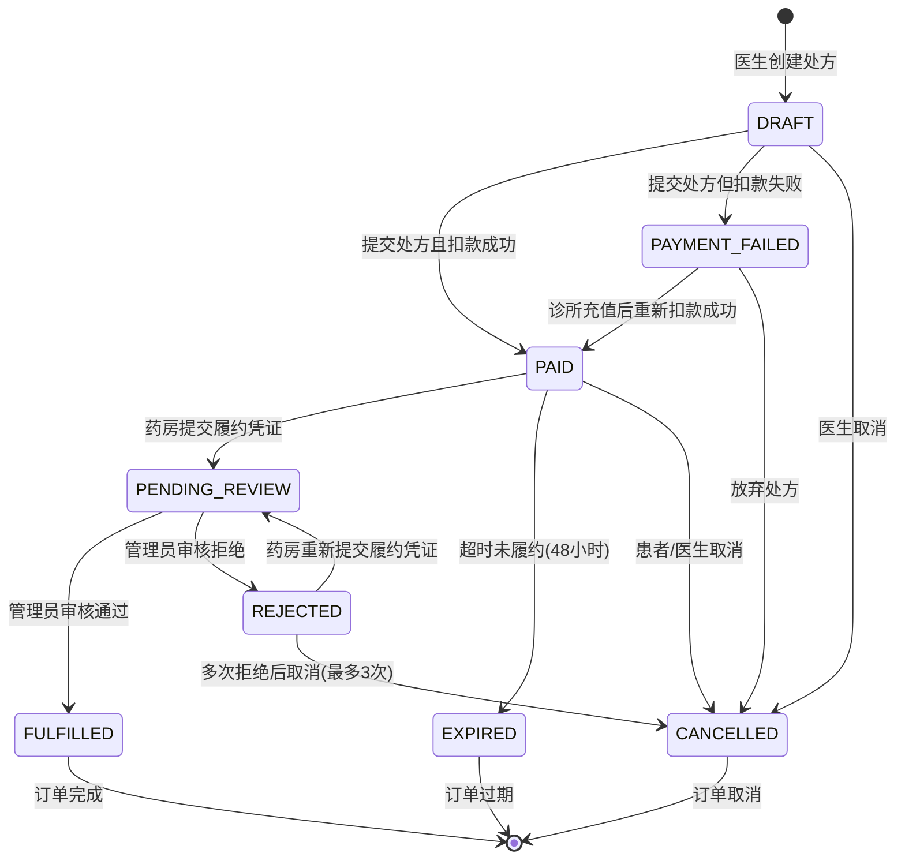

# 新西兰中医处方平台 - 架构设计文档图文双备份

**文档版本：** 1.02 
**创建日期：** 2025-06-08  
**架构师：** 资深架构师  
**项目：** 新西兰中医处方平台 MVP 1.0

---
## 0. 部署架构图

## 1. 系统整体架构拓扑图

### 1.1 图形化表示

### 1.2 架构说明

#### 用户层
- **医生端：** 医师使用的处方开具界面
- **药房端：** 药房操作员使用的履约管理界面
- **患者端：** 患者查找药房和查看处方状态
- **管理员端：** 平台管理员使用的后台管理系统

#### 前端层
- **Web应用：** 基于React/Next.js构建，支持医生、药房、管理员使用
- **移动应用：** 基于React Native，主要面向患者使用

#### API层
- **API Gateway：** NestJS Backend作为统一API网关，处理所有业务请求

#### 核心服务层
- **用户认证服务：** 统一用户身份管理和权限控制
- **核心业务服务：** 处方、订单、支付等核心业务逻辑
- **外部集成服务：** 第三方服务集成的统一接口
- **支撑服务：** 药品管理、药房管理、文件处理等支撑功能

#### 数据层
- **Supabase PostgreSQL：** 主数据库，存储所有业务数据
- **Supabase Auth：** 认证服务，管理用户登录和JWT令牌
- **Supabase Storage：** 文件存储服务
- **Redis：** 缓存层，提升系统性能

---
## 4. 服务架构详细图

### 4.1 图形化表示

```mermaid
graph TB
    subgraph "NestJS Backend Application"
        subgraph "API Gateway Layer"
            Gateway[API Gateway<br/>路由、限流、日志]
            Auth[Authentication Guard<br/>JWT验证]
            RBAC[Authorization Guard<br/>权限控制]
        end
        
        subgraph "User & Auth Service"
            UserController[User Controller]
            AuthController[Auth Controller]
            UserService[User Service]
            ProfileService[Profile Service]
            ReferralService[Referral Service]
        end
        
        subgraph "Core Business Service"
            PrescriptionController[Prescription Controller]
            OrderController[Order Controller]
            PaymentController[Payment Controller]
            PrescriptionService[Prescription Service]
            OrderService[Order Service]
            PaymentService[Payment Service]
            StateMachine[Order State Machine]
        end
        
        subgraph "External Integration Service"
            PaymentGateway[Payment Gateway Integration]
            NotificationService[Notification Service]
            GeoService[Geo Location Service]
            EmailService[Email Service]
            SMSService[SMS Service]
        end
        
        subgraph "Supporting Services"
            MedicineController[Medicine Controller]
            PharmacyController[Pharmacy Controller]
            AdminController[Admin Controller]
            ReportController[Report Controller]
            MedicineService[Medicine Service]
            PharmacyService[Pharmacy Service]
            FileService[File Service]
            ReportService[Report Service]
        end
        
        subgraph "Shared Modules"
            DatabaseModule[Database Module<br/>Prisma]
            ConfigModule[Config Module]
            LoggerModule[Logger Module]
            CacheModule[Cache Module]
            ValidationModule[Validation Module]
        end
    end
    
    subgraph "External Services"
        SupabaseDB[(Supabase PostgreSQL)]
        SupabaseAuth[Supabase Auth]
        SupabaseStorage[Supabase Storage]
        Redis[(Redis Cache)]
        Stripe[Stripe API]
        SendGrid[SendGrid API]
        MapService[Map Service API]
    end
    
    %% API Gateway connections
    Gateway --> UserController
    Gateway --> PrescriptionController
    Gateway --> MedicineController
    Gateway --> PharmacyController
    Gateway --> AdminController
    
    Auth --> UserService
    RBAC --> UserService
    
    %% Service connections
    UserService --> DatabaseModule
    UserService --> SupabaseAuth
    
    PrescriptionService --> DatabaseModule
    OrderService --> DatabaseModule
    OrderService --> StateMachine
    PaymentService --> PaymentGateway
    PaymentService --> DatabaseModule
    
    PaymentGateway --> Stripe
    NotificationService --> EmailService
    NotificationService --> SMSService
    EmailService --> SendGrid
    GeoService --> MapService
    
    MedicineService --> DatabaseModule
    PharmacyService --> DatabaseModule
    PharmacyService --> GeoService
    FileService --> SupabaseStorage
    ReportService --> DatabaseModule
    
    DatabaseModule --> SupabaseDB
    CacheModule --> Redis
```

### 4.2 服务架构说明

#### API Gateway Layer（API网关层）
- **API Gateway：** 统一入口，处理路由、限流、日志记录
- **Authentication Guard：** JWT令牌验证，确保请求来源合法
- **Authorization Guard：** 基于角色的权限控制，确保用户只能访问授权资源

#### User & Auth Service（用户认证服务）
- **User Controller：** 处理用户相关的HTTP请求
- **Auth Controller：** 处理认证相关的HTTP请求
- **User Service：** 用户管理核心业务逻辑
- **Profile Service：** 用户档案管理
- **Referral Service：** 医生推荐机制

#### Core Business Service（核心业务服务）
- **Prescription Controller：** 处方管理API
- **Order Controller：** 订单管理API
- **Payment Controller：** 支付管理API
- **Prescription Service：** 处方业务逻辑
- **Order Service：** 订单业务逻辑
- **Payment Service：** 支付业务逻辑
- **State Machine：** 订单状态机管理

#### External Integration Service（外部集成服务）
- **Payment Gateway：** 支付网关集成
- **Notification Service：** 通知服务统一接口
- **Geo Service：** 地理位置服务
- **Email Service：** 邮件服务
- **SMS Service：** 短信服务

#### Supporting Services（支撑服务）
- **Medicine Controller：** 药品管理API
- **Pharmacy Controller：** 药房管理API
- **Admin Controller：** 管理员功能API
- **Report Controller：** 报表统计API
- **Medicine Service：** 药品管理业务逻辑
- **Pharmacy Service：** 药房管理业务逻辑
- **File Service：** 文件管理服务
- **Report Service：** 报表生成服务

#### Shared Modules（共享模块）
- **Database Module：** 数据库连接和ORM管理
- **Config Module：** 配置管理
- **Logger Module：** 日志记录
- **Cache Module：** 缓存管理
- **Validation Module：** 数据验证

---

## 5. 数据库ER图.mermaid

5.1 图形化表示

## 架构师图表修改版本

### 2. 核心业务流程图（修改版）

基于产品经理的反馈，我对核心业务流程图进行了以下关键修改：

#### 主要修改说明：

1. **凭证交付方式**：明确了平台将凭证返回给医生，再由医生通过线下方式交付给患者
2. **患者药房查找**：改为可选的公开页面访问行为，不与订单流程强制绑定
3. **P1-P2验证**：明确标注了订单验证通过P1-P2 API实现
4. **去除患者通知**：移除了平台直接通知患者的步骤

### 3. 订单状态机图（修改版）

基于产品经理的反馈，简化了状态机并融入了UI表现说明：

#### 订单状态详细说明（融入UI表现）

| 状态 | UI显示 | 显示样式 | 用户操作 | 状态转换逻辑 | 权限控制 |
|------|--------|----------|----------|--------------|----------|
| **DRAFT** | 草稿 | 灰色标签 | 编辑、删除、提交 | 提交→PAID/PAYMENT_FAILED | 创建者可操作 |
| **PAYMENT_FAILED** | 支付失败 | 红色标签+错误图标 | 重新支付、取消 | 充值后重试→PAID | 创建者+管理员 |
| **PAID** | 已支付 | 绿色标签+二维码图标 | 查看详情、联系药房、生成二维码 | 药房履约→PENDING_REVIEW | 只读，可查看凭证 |
| **PENDING_REVIEW** | 审核中 | 黄色标签+时钟图标 | 管理员:审核 | 审核通过→FULFILLED，拒绝→REJECTED | 管理员可审核 |
| **REJECTED** | 审核拒绝 | 橙色标签+警告图标 | 药房:重新提交凭证 | 重新提交→PENDING_REVIEW | 药房可重新履约 |
| **FULFILLED** | 已完成 | 深绿色标签+完成图标 | 查看详情、下载凭证 | 终态，触发结算 | 只读 |
| **CANCELLED** | 已取消 | 红色标签 | 查看取消原因 | 终态 | 只读 |
| **EXPIRED** | 已过期 | 灰色标签+过期图标 | 查看详情 | 终态 | 只读 |

#### 主要修改说明：

1. **简化状态流转**：移除了`DISPENSING`状态，直接从`PAID`到`PENDING_REVIEW`
2. **精确化支付流程**：`DRAFT`可以直接流转到`PAID`或`PAYMENT_FAILED`，反映同步扣款模式
3. **明确重试流程**：`REJECTED`直接流转到`PENDING_REVIEW`，不再经过中间状态
4. **增加UI表现**：为每个状态定义了具体的UI显示样式、用户操作和权限控制
5. **融入业务规则**：明确了48小时超时机制和最多3次重试的业务规则

### 关键业务规则总结：

1. **同步扣款机制**：医生提交处方时立即进行扣款，成功则直接到PAID状态
2. **凭证生成**：PAID状态下生成二维码凭证，48小时有效期
3. **手动审核**：MVP 1.0采用管理员手动审核，不使用AI
4. **重试限制**：药房最多可以重新提交3次履约凭证
5. **自动结算**：FULFILLED状态触发平台与药房的自动结算流程

这些修改确保了技术实现与产品需求的100%同步，简化了MVP 1.0的复杂度，为后续开发提供了更精确的指导。